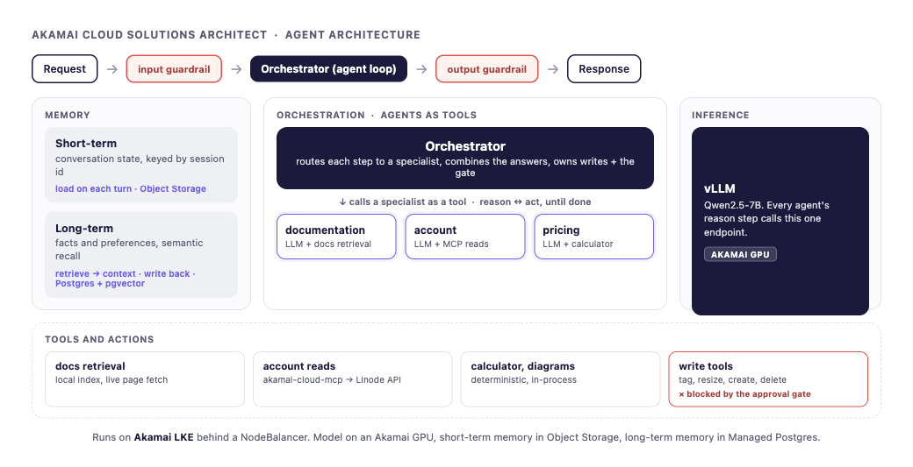
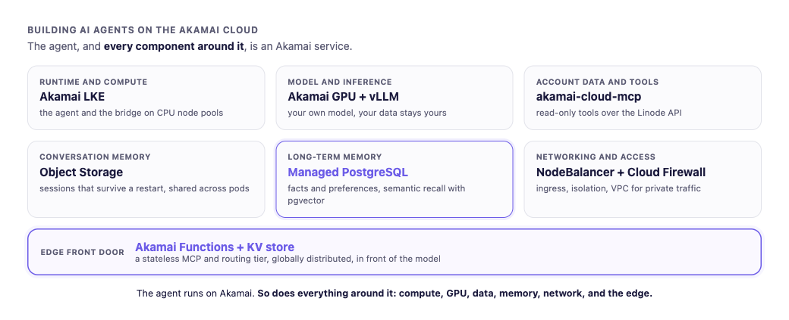
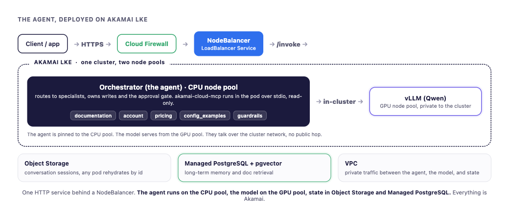
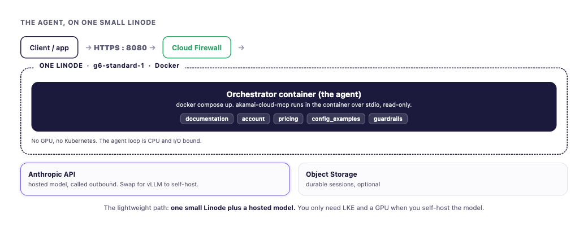

# Akamai Cloud Solutions Architect agent

The fully built agent in this repo. It is an orchestrator that routes work to focused specialists, reads a real Linode account through a read-only MCP server, prices resources, draws architecture, returns verified Terraform and Linode CLI for setup tasks, and makes changes only behind a human approval gate. Everything it needs runs on Akamai. It is the multi-agent build, the orchestrator with specialists as tools, and the workshop in [`../workshop/`](../workshop/) builds up to it.



## What you can ask it

Plain English about Akamai Cloud compute, LKE, Object Storage, networking, GPUs, inference, and billing. For example:

- List my Linodes and where they are
- What does it cost to run 3 GPUs for a month
- Draw my LKE cluster
- Give me the Terraform for a Managed PostgreSQL
- Tag linode 12345 with demo (then approve the change)

In Discord, reach it with `/ask`, `$sa`, an `@mention`, or a DM. Over HTTP, POST to `/invoke`. Account changes are gated: the agent shows the exact plan and waits for a human to approve.

## What is in here

- `src/`: the agent code.
- `deploy/`: a Dockerfile, Kubernetes manifests, a single-Linode compose, and scripts to ship it to LKE or one Linode.
- `data/llms.txt`: the Akamai docs index the documentation specialist searches.
- `.env.example`: the configuration.

## The code, file by file

- `api.py`: the FastAPI HTTP service for the orchestrator. `POST /invoke` runs a turn, `GET /healthz` is the probe, `GET /tools` lists the tools.
- `orchestrator.py`: the agent. A router that calls the documentation, account, and pricing specialists as tools (agents as tools), and keeps the diagram tools, the write tools, the approval gate, and the session on itself. Run `python -m orchestrator` for a local chat loop.
- `discord_bridge.py`: the Discord bot. Handles DMs and shows Approve and Decline buttons for writes.
- `mcp_integration.py`: launches the read-only `akamai-cloud-mcp` server and turns it into agent tools.
- `tools/`: the local tools. `writes.py` (approval-gated), `diagrams.py` (deterministic), `config_examples.py` (verified Terraform and Linode CLI), `regions.py` and `runtime.py` (self-report), `_linode.py` (the Linode API client), `registry.py` (the write manifest).
- `hooks/`: `approval_hook.py` (the deny-by-default gate) and `logging_hook.py`.
- `sessions.py` and `akamai_sessions.py`: conversation sessions on memory, file, or Akamai Object Storage.
- `config/`: `settings.py` (env) and `system_prompts.py`.
- `models/`: provider selection (vLLM, OpenAI, Anthropic).

## Run it locally

1. Python 3.11 or newer. Create a venv, then `pip install -e .`. That installs everything, including the MCP read server and the diagram tools. The diagram tools also need the Graphviz `dot` binary, which pip cannot install: `brew install graphviz` (or your OS package manager).
2. Copy `.env.example` to `.env` and set your provider (`VLLM_BASE_URL` for vLLM, or `MODEL_PROVIDER=anthropic` with `ANTHROPIC_API_KEY`), `LINODE_TOKEN`, and the session keys if you want durable sessions.
3. Chat with it locally, or serve it over HTTP:

   ```bash
   # local multi-agent chat loop, exposes nothing
   PYTHONPATH=src python -m orchestrator

   # or serve a REST API (optional)
   DOCS_INDEX_PATH=./data/llms.txt uvicorn api:app --app-dir src --host 0.0.0.0 --port 8080
   ```

   The HTTP service is optional. Use it when another program needs a REST endpoint, or for the deployed service behind a NodeBalancer. `--host 0.0.0.0` only binds all interfaces inside the box, it is not public until a NodeBalancer or firewall lets traffic in. For a demo you do not need it: the local REPL and the Discord bridge both work without exposing anything.
4. Call it:

   ```bash
   curl -s localhost:8080/healthz
   curl -s -XPOST localhost:8080/invoke -H 'content-type: application/json' \
     -d '{"message":"What model and endpoint are you on?"}'
   ```
5. Run the Discord bridge instead (optional): set `DISCORD_TOKEN`, then `PYTHONPATH=src python -m discord_bridge`. See `docs/discord-integration.md` for the full Discord setup (create the bot, the token, the intent, invite it). The bridge connects out to Discord, so it needs no inbound exposure.

## Everything maps to Akamai



- Runtime and compute: Akamai LKE, CPU node pools.
- Model and inference: Akamai GPU with vLLM.
- Account data and tools: `akamai-cloud-mcp` over the Linode API.
- Conversation memory: Akamai Object Storage.
- Long-term memory: Akamai Managed PostgreSQL with pgvector. The orchestrator uses sessions today; the Postgres-backed long-term store is the production extension.
- Networking and access: NodeBalancer, Cloud Firewall, VPC.
- Edge front door: Akamai Functions with the KV store.

## Observability

The agent emits OpenTelemetry traces to Langfuse when `LANGFUSE_PUBLIC_KEY` and `LANGFUSE_SECRET_KEY` are set (`LANGFUSE_HOST` too if you self-host it). Each turn shows the specialist calls, latency, tokens, and cost. Langfuse runs on Akamai as well. See `docs/open-source-agent-stack-on-akamai.md`.

## Deploy options

Use LKE when you self-host the model on a GPU. Use a single Linode when you point at a hosted model like Anthropic. The agent loop is CPU and I/O bound, so it needs no GPU or Kubernetes on its own.

### Akamai LKE (self-hosted model on a GPU)



1. Build and push the image: `GITHUB_USER=you GITHUB_TOKEN=ghp_xxx IMAGE=ghcr.io/you/akamai-sa-agent:latest ./deploy/scripts/build_and_push.sh`
2. Create the namespace and the secrets: `kubectl create namespace akamai-sa-agent`, then `./deploy/scripts/make_secret.sh` and `GITHUB_USER=... GITHUB_TOKEN=... ./deploy/scripts/ghcr_pull_secret.sh`.
3. Set your image in `deploy/manifests/deployment.yaml`, then `kubectl apply -f deploy/manifests/deployment.yaml -f deploy/manifests/service.yaml`.
4. The Service is type LoadBalancer, so LKE provisions a NodeBalancer. Hit `/invoke` through the external IP.

Pin the agent to the CPU node pool so it does not land on the GPU node serving vLLM. TLS on the NodeBalancer and an auth layer in front are the next step before you expose it publicly.

### A single Linode (Anthropic, no GPU)



See `deploy/single-linode.md` and `deploy/compose.yaml`. Provision a small shared Linode, set `MODEL_PROVIDER=anthropic` and `ANTHROPIC_API_KEY` in `.env`, then `docker compose up -d`. This is the lightweight option when you use a hosted model instead of self-hosting one.

## Design notes

- `docs/databases-on-akamai.md`: how Managed PostgreSQL with pgvector backs docs RAG, long-term memory, and operational state. Opt-in, the same pattern as sessions.
- `docs/open-source-agent-stack-on-akamai.md`: the self-hostable open-source agent tools (observability, memory, vector, serving, evals, guardrails) and how each maps to Akamai services.
- `docs/discord-integration.md`: run the agent in Discord. Create the bot, set the token and the message-content intent, invite it. The bridge connects outbound, so no inbound exposure is needed.

The workshop in [`../workshop/`](../workshop/) builds this agent up module by module. This is the finished, orchestrator-only version, ready to run and deploy.
